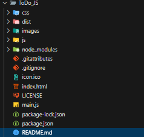

# 📋 Painel de Tarefas

Bem-vindo ao repositório do **Painel de Tarefas**, um aplicativo desktop para gerenciamento de tarefas com uma interface de quadro Kanban. Desenvolvido com HTML, CSS, JavaScript e Electron, ele permite organizar tarefas de forma visual e interativa, com suporte a prioridades, modo escuro e tempo relativo.

## 📸 Preview

.png>)
.png>)

## ✨ Funcionalidades

-   📝 **Adicionar Tarefas**: Crie tarefas com texto e prioridade (baixa, média, alta).
-   🗂️ **Quadro Kanban**: Mova tarefas entre as colunas "A Fazer", "Em Progresso" e "Concluído" usando drag-and-drop.
-   🎨 **Prioridades Visuais**: Tarefas são coloridas com base na prioridade (verde para baixa, laranja para média, vermelho para alta).
-   🌓 **Modo Escuro**: Alterne entre modo claro e escuro com um botão.
-   ⏳ **Tempo Relativo**: Veja há quanto tempo cada tarefa foi adicionada (ex.: "1 seg atrás", "2 horas atrás").
-   💾 **Persistência**: Tarefas e preferências de modo escuro são salvas no `localStorage`.
-   📊 **Contadores**: Cada coluna exibe o número de tarefas (ex.: "A Fazer (3)").
-   🖥️ **Aplicativo Desktop**: Construído com Electron para rodar como um programa nativo no Windows.

## 🗂️ Estrutura de Pastas



## 🚀 Como Executar Localmente

### Pré-requisitos

-   **Node.js** (versão 16 ou superior): Necessário para rodar o Electron.
-   **npm**: Gerenciador de pacotes do Node.js.

### Passos

1. Clone ou baixe este repositório:
    ```bash
    git clone https://github.com/kiminfodeveloper/ToDo_JS
    cd ToDo_JS
    ```
2. Instale as dependências:
    ```bash
    npm install
    ```
3. Rode o aplicativo

    ```bash
    npm start
    ```

Isso abrirá o "Painel de Tarefas" como um aplicativo desktop.

### Construir o Instalador para Windows

Para criar um instalador .exe:

1. Certifique-se de que todas as instâncias do Electron estão fechadas.
2. Execute

```bash
    npm run build
```

3. O instalador será gerado na pasta dist (ex.: Painel de Tarefas Setup 1.0.0.exe).

Nota: Se encontrar erros relacionados a permissões, execute o comando npm run build em um terminal com privilégios de administrador.

### 🛠️ Tecnologias Utilizadas

HTML5
CSS3 (com design responsivo e modo escuro)
JavaScript (manipulação de DOM, drag-and-drop, localStorage)
Electron (para transformar a aplicação web em desktop)
Electron Builder (para criar o instalador .exe)

### 📌 Possíveis Melhorias Futuras

🔔 Adicionar notificações para tarefas com alta prioridade.
📅 Suporte a datas de vencimento para tarefas.
🔄 Sincronização com um banco de dados (ex.: Firebase) em vez de localStorage.
🎨 Mais opções de temas (ex.: temas coloridos além de claro/escuro).
📈 Relatórios ou estatísticas de produtividade (ex.: tarefas concluídas por dia).

### 📄 Licença

Este projeto está sob a licença MIT. Veja o arquivo LICENSE para mais detalhes.

### 👨‍💻 Desenvolvido por Kevyn Melo

### Link direto de download

[Download](https://drive.google.com/file/d/1JFVOaVuTlGLBfKUqJQ6hGYTEM3T4_jSj/view?usp=sharing)
